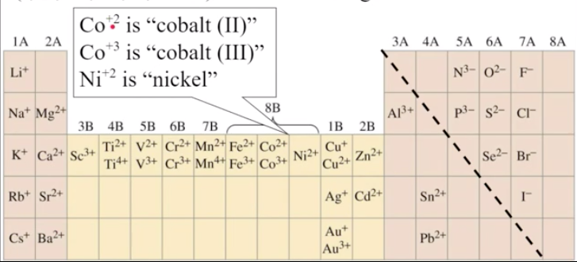
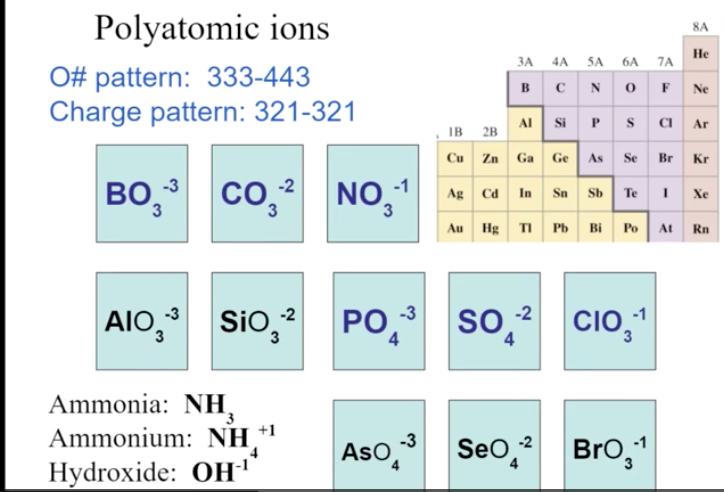
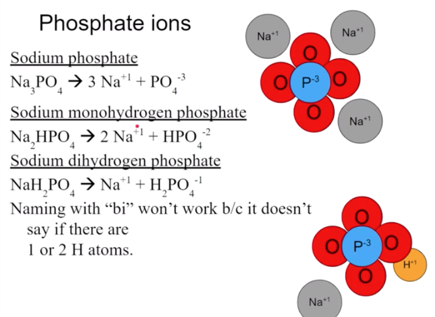
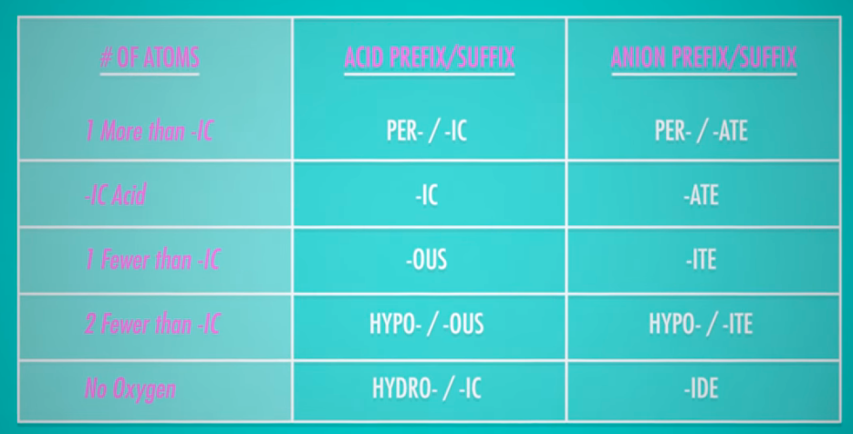
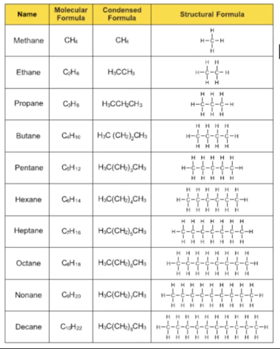

- Ionic compounds are ALWAYS expressed in empirical formula
	- There is no way to find the "true" molecular formula because it tiles
### Monatomic ions:
- Anions: gained electrons, negative charge. Mostly non-metals
	- Name by element + ide
- Cations: lost electrons, positive charge. Mostly metals
	- If multiple posibilities for charge, name using (II) where II is the positive charge of that ion
	- Name by element name + "ion"
- Cation first, anion last

### Polyatomic ions:
- types:
	- Binary ionic compounds: 2 monatomic ions (..ide)
	- Tertiary ionic compounds: 1-2 polyatomic ions (...ate)
- Memorize Borate, Carbonate, Nitrate4, Phosphate, Sulfate, Chlorate, Hydroxide, Acetate, AMmonium
	- See pattern for first 6
	- 
- Varations:
	- Normal anion: ....ide
		- Chloride: Cl-
	- Normal anion: ....ate
		- Chlorate ClO3-
	- 1 extra O:    per....ate
		- Perchlorate ClO4-
	- 1 fewer O:     ....ite
		- Chorite ClO2-
	- 2 fewer O:     hypo......ite
		- Hypochorite ClO-
### Bonds:
- Ionic bonds: bonding because of different isotopes of opposite polarity attracted to each other. Weak
- Covalent bond: Atoms share electrons. Strong

## Acids:
- One or two hydrogens become the cation in an ionic compound
- Chemical name starting with H+1 cation
- Tertiary anions ending with -ate are renamed -ic acid
	- HClO3 Normal: Hydrogen chlorate --> chloric acid
- Tertiary anions ending with -ite are renamed -ous acid
	- HClO2 hydrogen chlorite --> chlorous acid
- Binary anions ending with -ide renamed hydro-ic acid
	- HCl Hydrogen chloride --> Hydrochloric acid

| # of oxygen atoms | Acid Prefix/Suffix | Anion Prefix/Suffix |
|-------------------|--------------------|---------------------|
| 1 more than -IC   | Per....ic          | Per....ate          |
| -ic acid (polyatomic)| ...ic              | ...ate              |
| 1 fewer           | ...ous             | ...ite              |
| 2 fewer           | hypo...ous         | hypo...ite          |
| No oxygen/monoatomic | hydro....ic        | ....ide             |

### Naming molecular compounds
#### Ionic Compounds:
- Cation (metal) attracts to charge of anion (nonmetal)
	- ex Sodium chloride
#### Molecular Compounds
- Several nonmetal atoms bond by sharing electrons
- SO, SO~2~, SO~3~, S~2~O, etc
- Named with prefixes:
	- "Sulfer monoxide"
	- "disulfuer dioxide"
	- etc
#### Hydrated ionic compounds:
- Hydrate is ionic compound where formula includes a fixed number of water molecules. May look try, but contain moisture
- [formula]*#H~2~O
- [name]+[prefix]+[hydrate]
- Ex: Na~2~CO~3~*10H~2~O

- Alkanes: hydrocarbons with only single bonds between C atoms. Name ends in -ane
- C~X~H~2X+2~
- Prefixes:
	- Meth
	- Eth
	- Prop
	- But
	- Pent
	- Hex
	- Hept
	- Oct
	- Non
	- Dec 