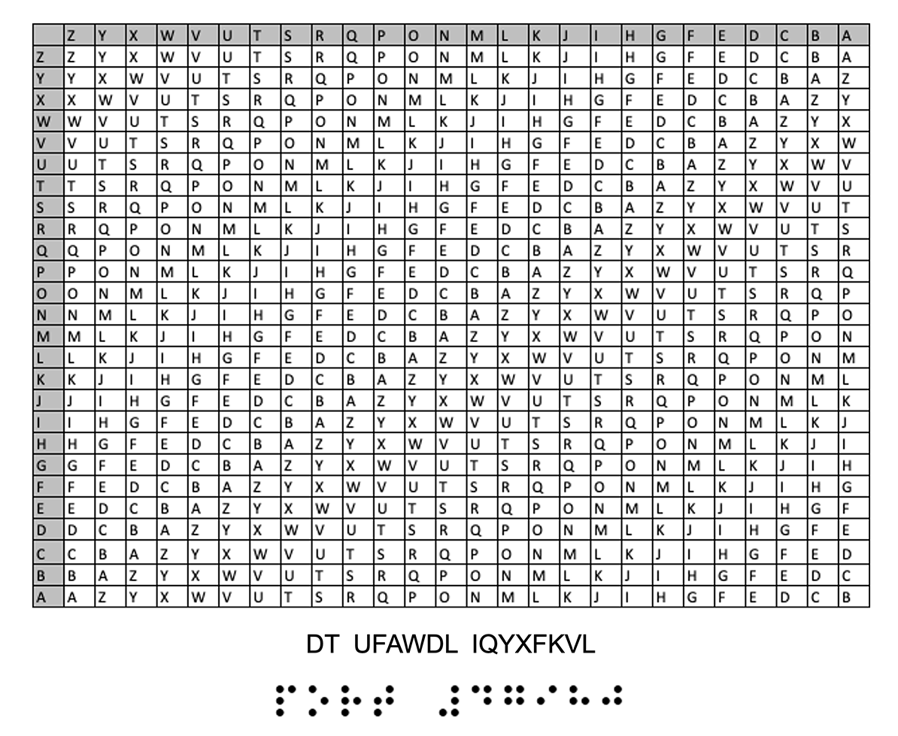

# Solution
- Immediately, I recognize the grid as a [Vigenere Cipher table](https://www.geeksforgeeks.org/vigenere-cipher/) table, but unlike a normal table, it is scrambled (see this footnote:[^1]). This means we get to decode this manually, oh yay!
- But first, Vigenere cipher needs a key. With this short of a ciphertext, it's next-to-impossible to crack (all Vigenere cipher cracking methods rely on the fact that the keyword is repeated - if the key length is at least as long as the cipher text, it is actually impossible and is known as a [one-time pad cipher](https://www.cryptomuseum.com/crypto/otp/index.htm)).
- So, below the table, we see some Braille. Decoding manually results in the text `PORT #47980`
- Using the hint of the CTF challenge `env.deadface.io`, connecting to the port using `nc env.deadface.io 47980` results in just the text `GOBLINS` being sent to us before closing the connection
- Turns out, this is the key we need to decrypt the message! Quick crash-course on decrypting vigenere using a table:
	1. Take the ciphertext and then put the keyword on top, repeating it as necessary
	`GO BLINSG OBLINSGO`
	`DT UFAWDL IQYXFKVL`

	2. Now, in the table, find the keyword letter on the left, scroll to the right in that row until you find the ciphertext letter, and the decrypted letter is the column header.
		- For example, the first letter. Find G on the left, scroll until you find D, and the decrypted letter is W
	3. We get the final message! Submitting the message itself is the flag.

[^1]: *If you want to not do it manually, you might notice that this table is actually the same as a normal Vigenere table except having gone through an Atbash cipher: A --> Z, B --> Y, C --> X, etc. Then, all you need to do to solve is atbash the cipher text, atbash the key, solve using your favorite automated vigenere cipher solver, and then atbash that result!

# Original CTF Challenge
Unable to use their RSA encryption program, luciafer resorts to using old school techniques to send a message out to the team. Can you decipher the code and find the flag?

Submit the flag as flag{flag text}

env.deadface.io