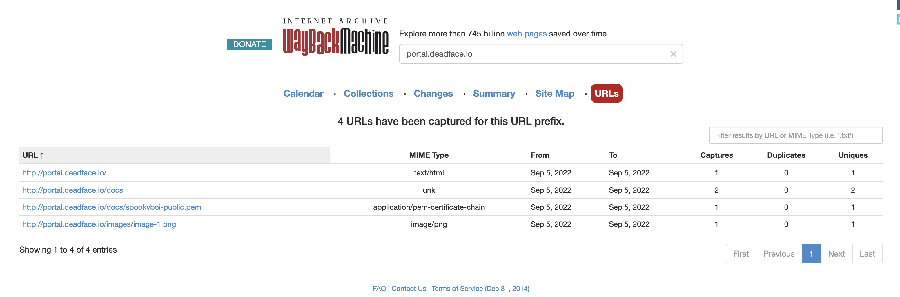

# Solution
- Pretty classic web archive challenge. The "intended" way to solve this is to find out on ghosttown that it is in the "docs" folder, but I would like to show the power of the web archive in this writeup.
- First, going to portal.deadface.io in the web archive finds a single archive that appears to be a login portal. Note that you can't really interact with it since this is just a snapshot of the website that is no longer online
- Instead, go back to https://web.archive.org, search for the link, and click "URLs". This brings up a list of all URLs ever archived on the URL prefix you gave, aka portal.deadface.io/* where * can be anything. Immediately, we see the docs page and the .pem file we need to solve the challenge! 

# Original CTF Challenge
It looks like DEADFACE members shared their public keys last month. All of them sent their keys over Signal or email except for spookyboi. He mentioned uploading his key to portal.deadface.io, but none of our analysts can get to the site. Submit the MD5 hash of the public key file as the flag.

Submit the flag as: flag{MD5_hash}.
