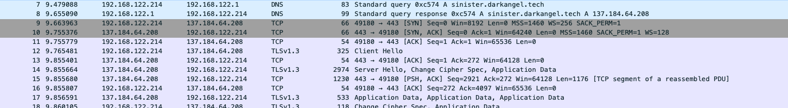
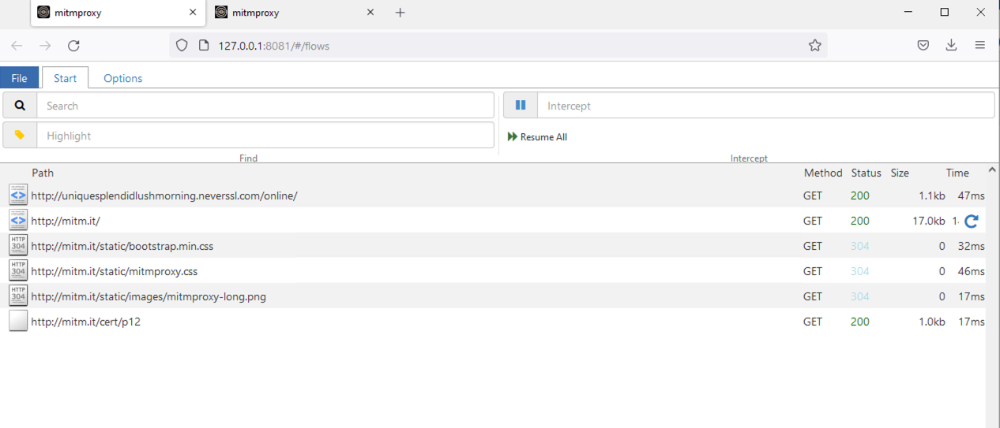
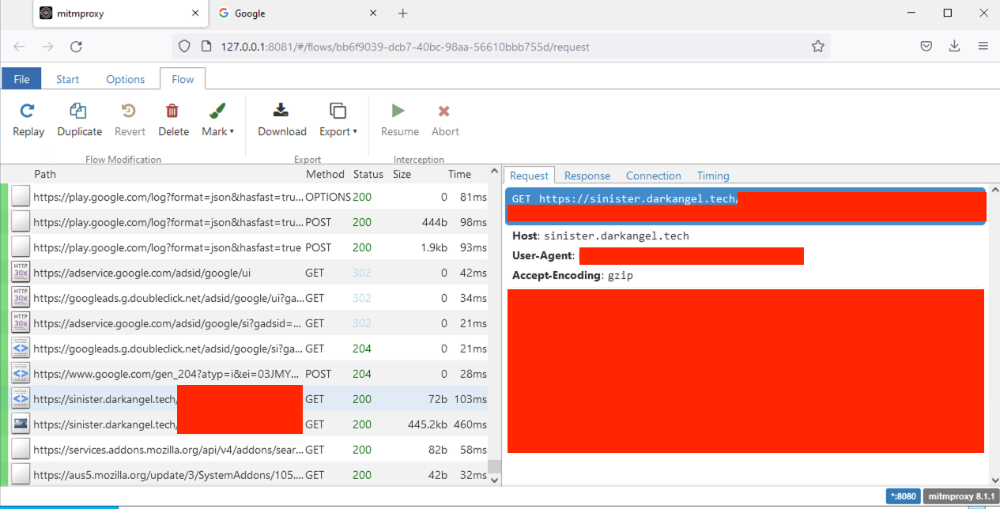

## Challenge

- Either submit the user agent or either of the URLs that the randomware attempts to access when run

## Initial thoughts

- So, we need to see exactly what the malware is trying to access. First thought: wireshark!
    - Wireshark allows us to snoop on the network traffic that occurs.
- Let's try it! 
- Oh no. The traffic is encrypted using HTTPS, and the fact that there is no HTTP traffic before this indicates that there is no way to trick the malware into a [HTTPS downgrade attack](https://auth0.com/blog/preventing-https-downgrade-attacks/).
- At this point, we have 2 options:
    1.  Look inwards into the binary to find where in the code it makes the web request and get the url(s) and/or useragent that way
    2.  Surround the binary and trick it into letting us decrypt its connections
- Naturally, I went with 2 because I don't have much experience with 1 yet with something as complex as this

## Online malware analysis tools

- So, there are many online malware sandbox tools that automatically analyze behaviors of malware. Some of the big ones include [any.run](https://any.run/) and [VirusTotal](https://www.virustotal.com/), but when I tried them out, none appeared to have HTTPS man-in-the-middle attack automation for free. So, I had to make my own:

## Using mitmproxy

- mitmproxy is a super simple proxy that allows you to decrypt HTTPS connections by installing a custom root certificate and then you get the system to proxy traffic through mitmproxy.
- Let's try it: download and run mitmproxy on a windows VM (you can use mitmproxy for a command-line viewer or mitmweb for a web interface), setup proxy settings in windows settings, download the mitmproxy certificate from http://mitm.it (you need to be using the proxy for the site to work), and run the malware
- Result: 
	- neverssl was just me checking if the proxy was working at all before installing the https certificate. neverssl.com is amazing for whenever you *want* the network to intercept your network request, such as wifi login portals
- Darn. So the thing is, applications can just *ignore* the system proxy settings, and that seems to be the case here. Instead, what we need is a way to force all traffic through the proxy. There are many ways to do this, including using a VPN, but the way I did it is through a [transparent proxy](https://en.wikipedia.org/wiki/Proxy_server#Transparent_proxy).
- There are many ways to do a transparent proxy, but I just found [Win2Socks](https://win2socks.com/) on a quick google search, and it seems to have the features I needed. Installing it, setting up so that all traffic is proxied, and running the malware:
- Result: 
- Success!
- One note: If a program uses certificate pinning (embedding the HTTPS certificate in the application itself instead of letting the system handle all of the encryption) or some sort of custom encryption, this will fail, and then you're stuck with strategy #1, reverse engineering, unless you have the private key to the HTTPS certificate

# Original CTF Challenge

An "Indicator or Compromise" (IoC) is a unique feature of a particular piece of malware. IoCs are often used to help virus scanners and network tools identify the malware so that it can be blocked.

The Dark Angel cryptoware has three network-based IoCs. Two of them are URLs that the malware connects to. The other is the HTTP UserAgent string. Enter one of the three as the flag for this challenge.

For the UserAgent string, don't enter the full header; only enter the UserAgent string itself, as in:

flag{python-requests/2.26.0}

... or ...

For the URL, include the protocol, the server, and the full path, without the URL parameters, as in: flag{http://darkangel.linode.com/mymalware/you-are-hosed.php}

Only one of the three flags is required to complete the challenge.

(This is the same link as in RansomWAR 1, repeated here for convenience.)
[darkangel-crypt-03.exe](../../_resources/darkangel-crypt-03.exe)