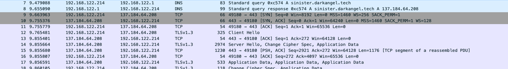
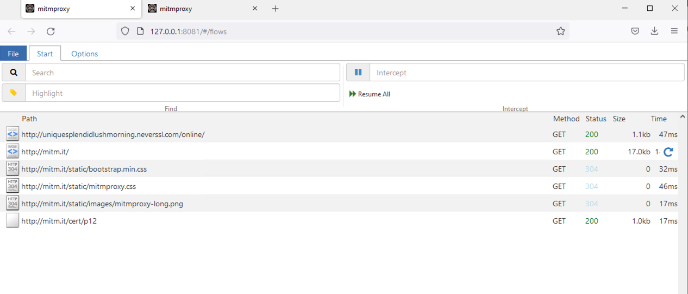
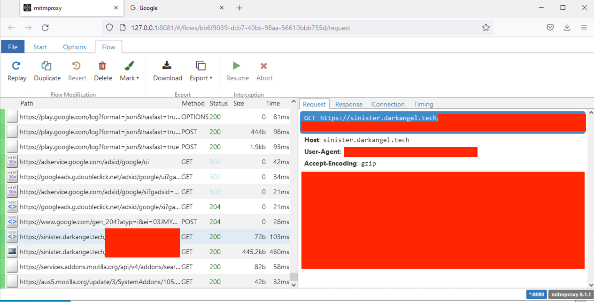

## Challenge
- Either submit the user agent or either of the URLs that the randomware attempts to access when run
## Initial thoughts
- So, we need to see exactly what the malware is trying to access. First thought: wireshark!
	- Wireshark allows us to snoop on the network traffic that occurs.
Let's try it!

- Oh no. The traffic is encrypted using HTTPS, and the fact that there is no HTTP traffic before this indicates that there is no way to trick the malware into a [HTTPS downgrade attack](https://auth0.com/blog/preventing-https-downgrade-attacks/).
- At this point, we have 2 options:
	1) Look inwards into the binary to find where in the code it makes the web request and get the url(s) and/or useragent that way
	2) Surround the binary and trick it into letting us decrypt its connections
- Naturally, I went with 2 because I don't have much experience with 1 yet with something as complex as this
## Online malware analysis tools
- So, there are many online malware sandbox tools that automatically analyze behaviors of malware. Some of the big ones include [any.run](https://any.run/) and [VirusTotal](https://www.virustotal.com/), but when I tried them out, none appeared to have HTTPS man-in-the-middel attack automation for free. So, I had to make my own:
## Using mitmproxy
- mitmproxy is a super simple proxy that allows you to decrypt HTTPS connections by installing a custom root certificate and then you get the system to proxy traffic through mitmproxy.
- Let's try it: download and run mitmproxy on a windows VM (you can use mitmproxy for a command-line viewer or mitmweb for a web interface), setup proxy settings in windows settings, download the mitmproxy certificate from http://mitm.it (you need to be using the proxy for the site to work), and run the malware
- Result: 
- Darn. So the thing is, applications can choose to *ignore* the system proxy settings, and that seems to be the case here. Instead, what we need is a way to force all traffic through the proxy. There are many ways to do this, including using a VPN, but the way I did it is through a [transparent proxy](https://en.wikipedia.org/wiki/Proxy_server#Transparent_proxy).
- There are many ways to do a transparent proxy, but I just found [Win2Socks](https://win2socks.com/) on a quick google search, and it seems to have the features I needed. Installing it, setting up so that all traffic is proxied, and running the malware:
- Result: 
- Success!
