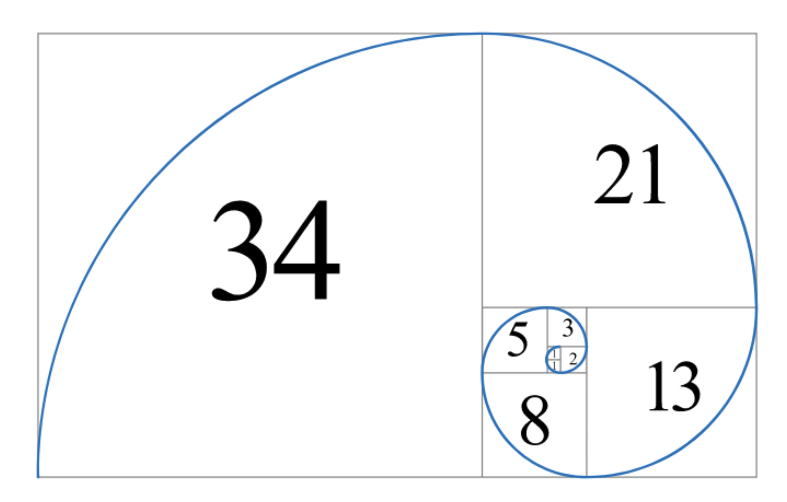

# Steps
- The challenge alludes to a twitter post. On Ghost town, you can find the post https://ghosttown.deadface.io/t/circling-the-drain/59/ which has a broken image link. Opening it leads to a twitter post with this image in it: 
	- If you don't already know, this is simply the fibbonacci sequence 0, 1, 1, 2, 3, 5, 8, 13, 21, 34, etc...
- One thing I noticed: the flag format is `flag{STUFF}`, but the text starts with an f, m, which is one after l, b, one after a, and i, two after g
- Because we have characters and some non-printable characters, I assumed that this would work on ASCII code. I originally actually used excel to test the theory, but then made a python script:
```python

def get_char(character, fibo):
    return chr(ord(character) - fibo)

e = 'fmbi~i{v1d`t3ygz~”vfbn€'

d = ""

fibo = [0, 1, 1, 2, 3, 5, 8, 13, 21, 34]
current_num = 0
for i in e:
    d += get_char(i, fibo[current_num])
    current_num += 1
    if current_num >= 10:
        current_num = 0

print(d)
```
- Some notes about getting to this point:
	- I originally thought that the fibonacci sequence would continue indefinitely, and that some modulus stuff would come into play. Turns out this was complete overcomplication: it just repeated itself after 34 as my teammate found out


# Original CTF Challenge
A message was left by DEADFACE on one of De Monne's machines. In Ghost Town, mirveal mentioned that he posted a hint on Twitter.

This was the message that was left:

```fmbi~i{v1d`t3ygz~”vfbn€``` (**Addition by me: note the non-printable characters!**)
Can you tell us what it says? Submit the flag as flag{plaintext}.