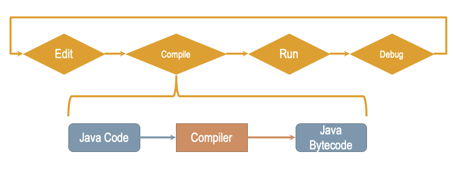
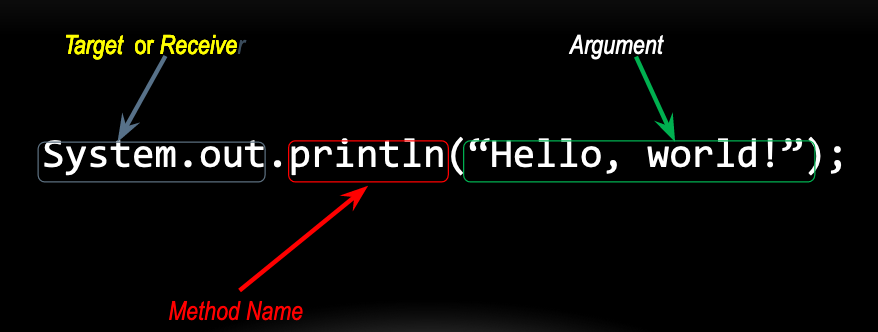
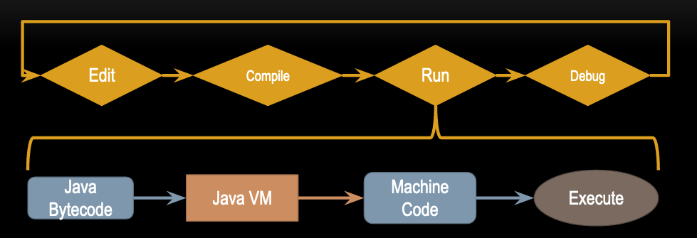

CS Vocabulary and Java Basics

### Brief history:
- Released 1995 by Sun Microsystems
	- now Oracle
- Designed for "embedded devices", or TVs
	- Deisnged for small, lightweight programs
	- Memory-concious 
	- This makes it ideal for writing programs distributed via internet

## Key characteristics:
- "Write once, run anywhere"
	- Compiling to bytecode which can be run on any java VM
- Automatic memory management
	- Auto-allocate and reclaim memory as needed
	- Other languges (C, C++) require manual memory tracking
- Object-oriented

### Writing java programs:
- Tools:
	- Editor (usually an IDE for java, can be a text editor)
	- Compiler (JDK, translate to bytecode)
	- Virtual Machins/Runtime to translate bytecode to machine code
	- Debugger to help track down and fix problems




### Identifiers:
- Names of classes, methods, variables, etc
- Can have letters, digits, underscrores
	- First chracter cannot be a digit
- Indentifier should be descriptive, but not unwieldy
	- Bad: x, myVariableThatIsUsedToCountSomething
	- Good: count, numTries, xCoordinate
- Naming conventions:
	- Class names start uppercase, variables/methods/etc start lowercase
		- e.g. String, PrintStream, MixedFraction
	- Camel case everything else (capitalize first letter of each word that was put to gether)
		- e.g. size, numLoops, firstName

### Methods:
- defined behavior of a particular class
- Passing a message in Java is "calling" or "invoking" a method
- Method calls have the following parts:
	- The target or receiver of the message
		- Object you are using to call one of its methods
	- Method name
	- Some number (or zero) arguments
		- Addition info needed by the method

### Writing java Programs
- Many predefined classes/objects
	- System.out is one example
	- Prevents "reinventing the wheel"
	- Documended on the Java Website
		- https://download.oracle.com/javase/8/docs/api
		- BOOKMARK THIS PAGE

### Method call:


### Actually writing java programs:



- Every java program consists of one or more classes
- At least one main method
	- Deinfes where the program starts
### Java Syntax:
General form:
```java
public class ClassName {
   public static void main(String[] args) {
      statement1;
      statement2;
      statement3;
      ...
      statementN;
   }
}
```

### Strings:
- Sequence of characters
	- Usually used for input/output
- Closed in double-quotes
	- `"Hello, world!"`
- `String` is an example of a pre-defined Java class
