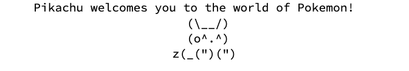

Escape_Sequences

Escape Sequences

### Escape Sequences:
- Some characters cannot be included in a string
	- ", newline, etc
	- to include these, we use an *escape sequence*
- Escape sequences:
	- `\n` - newline
	- `\"` - quotation mark
	- `\t` - tab
	- `\\` - backslash
- Ex:
	- `System.out.println("\ta\tb\tc"); //____a____b____c` 
		- (____ is a tab)
	- `System.out.println("\\\\"); // \\`
	- `System.out.println("'"); //'`
	- `System.out.println("\"\"\""); //"""`
	- `System.out.println("C:\nin\the downward spiral");`
		```md
		C:
		in    he downward spiral
		```
- Ex 2:
	- Write a line of code that prints out `/ \ // \\ /// \\\`
		- `System.out.println("/ \\ // \\\\ /// \\\\\\");`

- Pikachu:
	- Write a full java program that prints out this:
	
	```java
	public class PikachuWelcome {
		public static void main(String[] args) {
			System.out.println("\tPikachu welcomes you to the world of Pokemon!");
			System.out.println("\t\t\t\t  (\\__/)");
			System.out.println("\t\t\t\t  (o^.^)");
			System.out.println("\t\t\t\tz(_(\")(\")");
		}
	}
	```