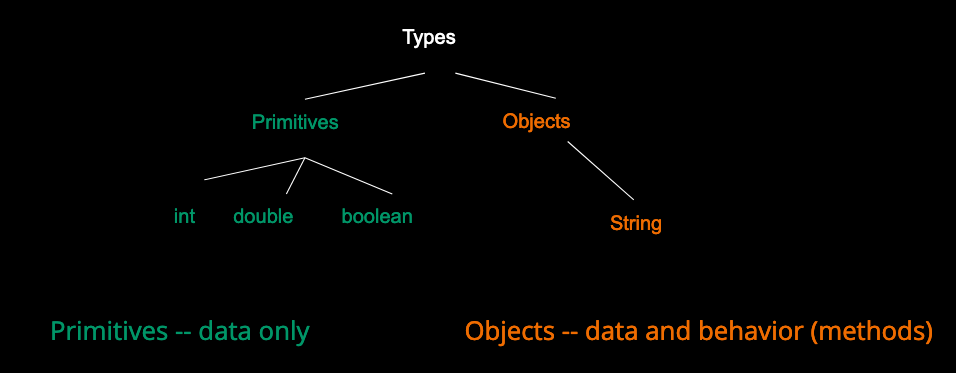

String Objects

- Primitives: "atoms" of variables - simplest type that programmers use. Made of no other data types, cannot be broken down any further.
- Objects: "molecules" - built from primitives and other objects. Can be extremely complicated




### Class vs Object
- Object contains variables and methods (functions/actions)
- Think of a Class as a “blueprint” for making Objects: it gives the instructions for how to make an Object, what information the Object should contain, and what behavior it should have. We call an individual Object built from the Class blueprint an instance of that class.

Objects often have methods available on them that you can call.  These are things that all objects of this type can DO.
What if we wanted to find out the length of a String? 
```java
String s = "Hasta mañana";
System.out.println("The length of s is " + s.length());
```

### Syntax for Objects
`<variableName>.<methodName>(<parameterName1>, <parameterName2>, ...);`
- Dot notation
- No parameters? Nothing in parenthesis `s.length()`

### substring()
```java
s.substring(from);
s.substring(from, to);
```
substring returns the portion of the string s from "from" to the end or "to".
"0123456789" where the digit is the index number, the substring(2,6); --> "2345". "From including index 2 up to but not including index 6"

It’s possible to make a method call with invalid parameters.   
→ Error message: StringIndexOutOfBoundsException

### indexOf()
- Returns index where a substring occurs, or -1 if it does not exist.
- Looks at entire s and finds first instance of string.
- `s.indexOf(substring);`

### charAt()
- Gets chracter at index
- `"testing".charAt(4) == 'i'`

### toUpperCase and toLowerCase
- Changes a String's case to lower or upper
- returns a String
### equals
- `"test".equals("test");`