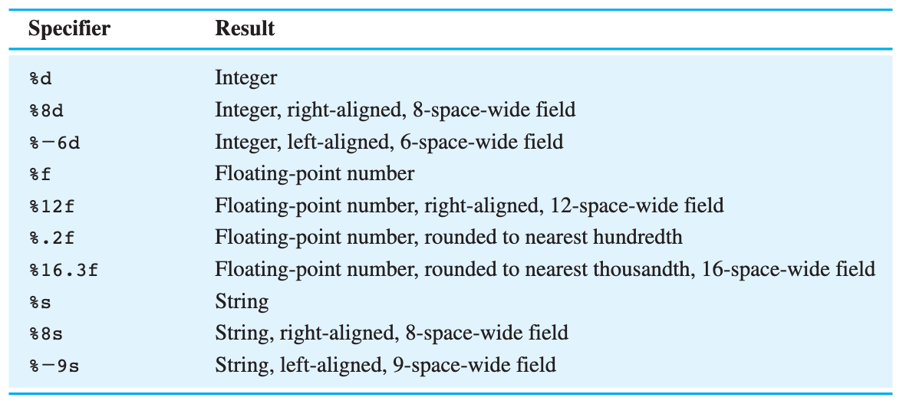

4.3_Text_Processing

### Text Processing: Editing and formatting strings of text
## char type:
- Single character of text
	- Literal values are placed between single quotes
	- Can be any character, including non-printables and whitespace like \n
	- Since primitive, use `==`
	- `char myChar = 'a';`
- Using String.charat(idx) you can get the char primitive at an index in a string
- VS int:
	- char is actually a 16-bit integer because of unicode standard
	- Java automatically converts from char to the correspoding int value when adding to integer
	- You can use casting to go from int to char
- Cumuative Text Algorithms: an algorithm that uses text and adds to it over time
	- Cumulative concatenation: Concatenate characters together in a certain way to rearrange order
## System.out.printf
- Formatter printing
- `System.out.printf(format string, parameter, ...)`
#### Format specifiers: Defined in format string, states where to replace in the string with parameter
- Different depending on type: %d for integer, %f for float (decimal), %s for string, etc
- `System.out.printf("location: %d", 5); //location: 5`
- Formatters:
	- Add number(s) between % and specifier to set width, precision, and alignment

What I will find useful: I will find the ability to use printf extremely useful in formatting text to the console with evenly-spaced text that is right or left aligned and with a set decimal precision. 