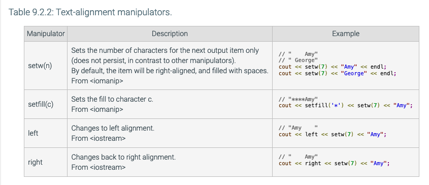
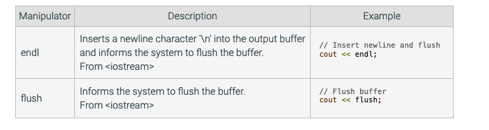
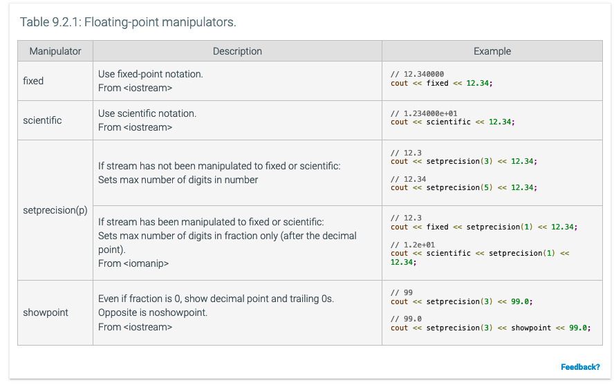

```c++
#include <sstream>

istringstream inSS(userInfo);  
string firstName, lastName, oneLine;
// use inSS instead of cin to read from string variable instead of system input
inSS >> firstName >> lastName;

// clear buffer
inSS.clear();
// Copy new text to buffer
inSS.str(userInfo);

// Keep going until no more to read (.eof() function)
while (inSS >> data) {
   ...
}

getline(inSS, oneLine);

// cout but to a string instead of console
   ostringstream outSS;
   ostringstream outSS;
```

### File streams:
```c++
#include <iostream>
#include <fstream>
using namespace std;
int main() {
   ofstream outFS; 
   ifstream inFS; 
   string str;
   outFS.open("myfile.txt");
   outFS << "This is a test data.";
   if (!outFS.is_open()) {
      cout << "Could not open file myoutfile.txt." << endl;
      return 1;
   }
   outFS.close();
   inFS.open("myfile.txt");
   cout << "Reading from file..." << endl;
   inFS >> str;
   cout << str;
   return 0;
}
```