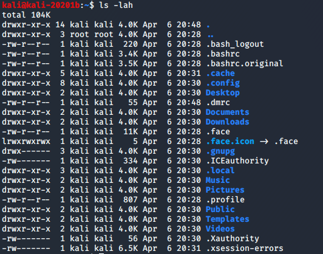

2. Users and Privileges

- `passwd [USER]`
Changes password for USER or current user

Permissions:
- First column
- `-rwxr-xr--`
	- First letter = type of "file
		- `-` = file
		- d = directory
	- Second part: 3 groups of 3
		- r = read
		- w = write
		- x = execute
		- If `-`, does not have permission
	- Group order:
		- Owner (read, write and execute)
		- Group (read and execute)
		- Everyone (read only)
## Commands
- `chmod 777 FILE`
Gives full access, read, write, and execute to everyone
- `adduser NAME`
Creates a user with name
- `su [user]`
Switch to a user
## Files
- `/etc/passwd`
List of users
- `/etc/shadow`
List of passwords hashed