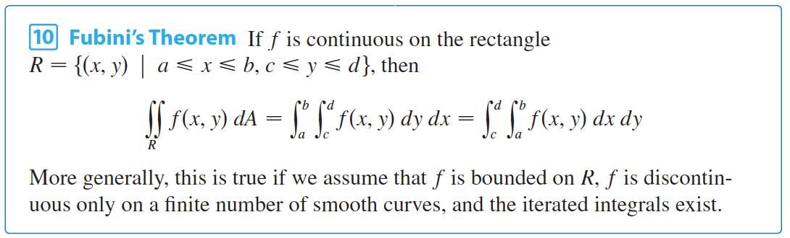

- Chain rule: https://math.libretexts.org/Bookshelves/Calculus/Book%3A_Calculus_(OpenStax)/14%3A_Differentiation_of_Functions_of_Several_Variables/14.5%3A_The_Chain_Rule_for_Multivariable_Functions
- Directional Derivative: directional derivative at point *a* in direction **unit** vector *u* of function f(x) = gradient of f(a) dot product u
	- https://www.khanacademy.org/math/multivariable-calculus/multivariable-derivatives/gradient-and-directional-derivatives/e/compute-directional-derivatives
- Gradient: Gradient of a function f is the vector <dz/dx, dz/dy, ...> for all independent variables
	- Gradient of z = x & y with a 2-d vector of <x, y> is the tangent vector in the direction of greatest (positive) ascent (slope) with magnitude equal to this maximum slope
	- Gradient of constant = x, y, z with a 3-d vector of <x, y, z> is the vector at x,y,z normal to the plane at that point
- Gradient from 2 directional derivatives:
	- use u (unit vector) dot gradient = directional derivitive:
		- f~x~ * u~x~ + f~y~ * u~y~ = gradient
		- Systems of equations, solve for f~x~ and f~Y~
- Double integrals:
	- double integral of f(x,y) over region R = 
	- 
	- Note: R = [a, b] X [c, d] just means a <= x <= b and c <= y <= d
- Projection:
	- Project b onto a: (a dot b) / magnitude of a^2 * vector a
	- Magnitude of dot product = |a||b|cos theta
	- 

