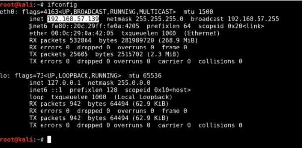

1. IP Addresses

Get IP address (Linux): `ifconfig`

- IP address = Layer 3
- 8 bits = octect, 4 octects per IPV4
- Binary:
	- 128 64 32 16 8 4 2 1
	-  0  0  0  0  0 1 1 1 = 7.7.7.7
- IPV4:
	- 2^64 = 4.29 billion exists, not enough
- IPV6:
	- 2^128 = a LOT
	- IPV6 isn't used as much, IPV4 is still main
- NAT (Network Address Translation):
	- EVERYTHING that connects to internet needs IP address
	- Assign Private IP address:
		- Class A (SUPER huge): `10.x`
		- Class B: `172.16.x to 172.31.0.0`
		- Class C (Most common): `192.168.x`
	- Use Private IP address is good enough to communicate within network + all IPs come out of one public IP