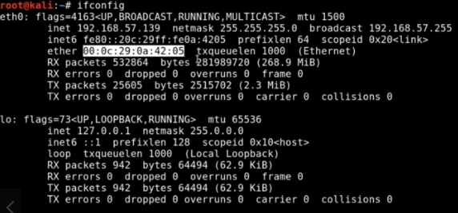

2._MAC_Addresses

2. MAC Addresses

**Layer 2:**
- MAC = Media Access Control
	- `ifconfig` ether = MAC Address

- Anything that uses network will use MAC address
	- **Switches** (Layer 2) use MAC addresses to identify
- Mac Address identifier:
	- First 3 pairs of 6 MAC Address define the company registered with it
	- Quick way to look up devices