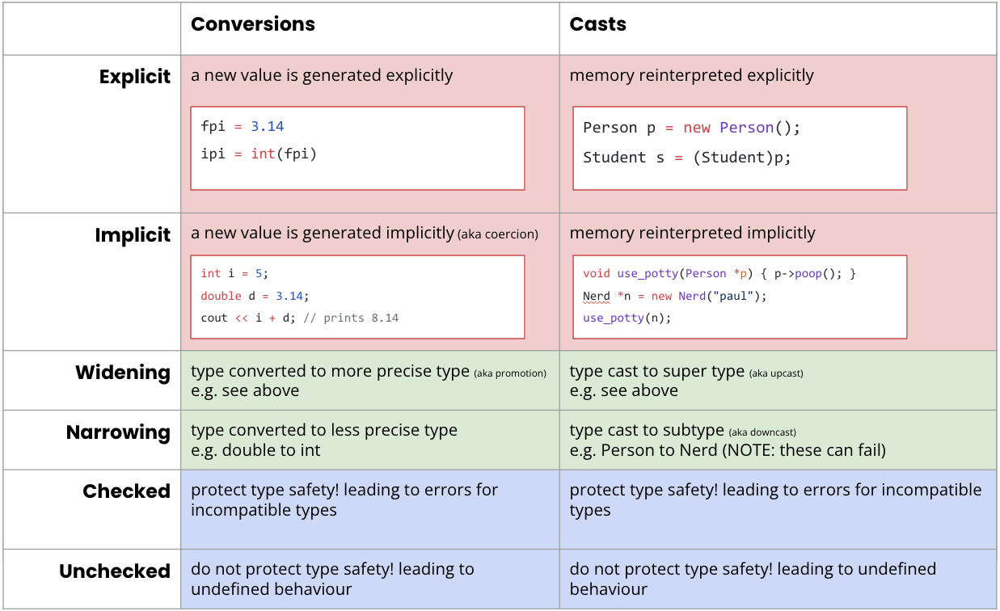

- Variable: symbolic name associated with storage location
	- Contains value or pointer to value
	- Contains name, type, value, binding, storage, lifetime (timeframe which variable exists), scope, mutability
- Value: piece of data
	- Contain types, value, storage, lifetime (timeframe which value exists), and mutability
## Types
- Classification to identify category of data
- Defines range of values, size, encoding, valid operations, usage context, and conversions/casings
- Used to define variables, type checking, type inference, type conversion, type casting, polymorphism, generics
- Typed language: language where datas have types
	- If variable is bound to a single value, then it has a type
	- if var can change type later with new binding, it is not a typed variable
	- Values always associated with type
- Types created when class/enum/interface/etc is defined
- Class inheritance defines **supertype/subtype** relationship
	- Subtype inherits properties from supertype
		- Subtype polymorphism
- A is a subtype of B if and only if:
	- Every element in the set of values of A is also in the set of values of B
	- An object of type A can be used in any code that requires an object of type B
### Type Types
- Value Types
	- Can be used to instantiate objects/values
- Reference Types
	- Can only be used to define other pointers/object/references/references
	- cannot be used to instantiate objects (like abstract classes)
### Type Equivalence
- Name Equivalence: 2 values/variables are equivalent types only if type names are identical
	- C++, Java, etc (most statically typed)
- Structural Equivalence: 2 values are equivalent if structures identical, regardless of type names
	- Python, JS (most dynamically typed)
### Type Checking Approaches
- Strictness:
	- Strong: guarantees all operations are only invoked on objects/values of appropriate types
	- Weak: does NOT guarantee all operations are invoked on appropriate types
- Compile vs run time:
	- Static typing: type checks determines type of every expression at compile time, verifying compatibility
	- Dynamic: checked as the program executes, and raises runtime exception otherwise
- Weak static: ASM, C, C++
- Strong Static: C#, Go, Haskell, Java, Scala
- Dynamic (strong): JS, Perl, PHP, Ruby, Python, Smalltalk

#### Static Type Checking
- Explicit types (C++) or inferred types (Haskell)
- Requires **variables have fixed types**
- Inference issue: complex, "constraint satisfaction" (e.g. is input int or double)
- Downcasing, example requires run-time type checking
- Conservative
- Pros: Faster code (less runtime checks), detects bugs earlier, no need to write custom type checking
- Cons: Conservative, can error out perfectly valid code, Requires a type checking phase before execution
#### Dynamic Type Checking
- Safety of operations on var/vals checked as program runs
- In dynamically typed languages: "types are associated with values and not variables"
- **Each variable stores type information (type tag)**
- **Duck Typing**: Attempt to call methods by name, even if not related
	- "If it looks like a duck and quacks like a duck, it must be a duck"
- Pros: Increased flexibility, duck typing generalizes functions, simpler code b/c less type annotations, faster prototyping
- Cons: Errors detected much later, type checking is slow, requires more testing for same level of assurance, no way to guarentee safety across all possible executions
#### Gradual Typing
- Choose **per-variable whether a type is defined or not**
- if untyped, then types detected at runtime
- If typed, errors detected at compile time
- If untyped passed to typed, only checks runtime
#### Strong Typing
- language NEVER has undefined behavior due to type issues
- Requirements:
	- **Type-safe**
	- **Memory safe**
	- Can be enforced statically or dynamically
- Techniques:
	- before eval expression, validate all operands compatible
	- All conversions/casts between types are checked, exception if not
	- Pointers NULL or valid object at creation
	- Array access are bounds checked
	- Objects can't be used after destroyed
- Checked Casts:
	- Cast that errors if illegal cast
- Pros: Dynamically reduced software vulnerabilities, earlier detection of bugs/errors
- Cons: performance, and legacy languages are weakly typed
#### Weak Typing
- **Not type-safe**
- **Not memory-safe**
- Can have **undefined** behavior!
- Check: if no undefined behavior ever, probably strong typing
- C/C++
## Type conversions/Type Casts
- Used when type A is held, but operation requires type B
	- e.g. int value passed to function requiring float value
- Type **conversion**: takes value of A, generates whole **new value** of type B (different underlying data storage)
- Type **cast**: Takes type A and **views** as if type B, no conversion
	- Typically used with objects
- static_cast is conversion in C++, dynamic_cast is actually cast
### Explicit vs Implicit
- **Explicit**: Forces using syntax to convert/cast
	- Convert compile time error into runtime check
- **Implicit**: automatically **coerces** type without syntax
	- Prioritized set of rules for coercions
	- **Type coercsion**
	- Look at:
		- Variable assignment
		- Math operations (int to float)
		- calling function/function type signature
		- returning value & function return value
- Type promotion: convert narrow into wider type (int to double)
### Widening vs narrowing
- Widening: int to long, float to double, Student to Person
	- Convert **subtype to supertype**
	- Value-preserving
	- Can be done with "upcast" and can be done implicitly sometimes
- narrowing: float to int, int to short, Person to Student
	- Convert **supertype to subtype**
	- not value preserving
	- "Downcast"
	- Can fail if not compatible
### Checked vs Unchecked
- Checked: every conversion is checked at runtime for validity
- Unchecked: some invalid conversions/casts may not be checked
	- lead to undefined behavior
# Scoping
- in-scope = "active binding"
- Lexical environment: set of in-scope variables and functions at a point in a program
- Variable lifetime: limited to execution where defined
- Value lifetime: may extend indefinitely if copied
## Lexical Scoping
- Programs contain nested contexts: files, classes, functions, blocks, etc
- Determine variables in scope at position X by looking at X context, then looking at successively larger enclosing contexts around x
- Python scoping: **Local, Enclosing, Global, Built-in**
	- Local: current code block, function body, or lambda
	- Look at enclosing function if nested functions
	- Look at top-level variables (global)
	- Built in python keywords
- Contexts:
	- Expression: limited to within expression
	- Block: within code block
	- Function: with function
	- Class: within class
	- Namespaces: only within namespace
	- Global: available to all functions in program/file
## Dynamic Scoping:
- When reference variable, program tries to find it in enclosing blocks
	- If not found, search calling function and then its calling function, etc
- Uses function invocation, not function declaration, as scope
# Memory Safety
- Memory unsafe languages:
	- Out of bound array indexs
	- Unconstrained pointer arithmetic
	- Allow casting to incompatible types
	- Allow use of uninitialized variables/pointers
	- Allow use of dangling pointers to dead objects
- Safe languages:
	- Throw exceptions for out of bound array indexes
	- Disallow pointer arithmetic
	- Throw exception/compiler error for invalid casts
	- Exception/error if uninitialized used, or hide explicit pointers
	- Prevent programmer-controlled object destruction, and use Garbage Collection
- Strategies:
	- Memory Leaks/Danging Pointers: Garbage Collection or Ownership Model (C++ smart pointers)
## Garbage Collection
- GC when no longer any references to object
- Not possible to predict when: only does so with **memory pressure**
### Mark and Sweep
- Mark phase: identifies all objects still referred to and in-use
	- Mark In-use: a key root object (global vars, local vars, parameters on call stack), or BFS reachable from root object
	- 
- Sweep phase: scan heap memory to free unmarked objects
	- Heap has linked list of objects, can free as appropriate
	- Coalesced adjacent free blocks into single large block
- Pros: simple, no issues with cyclic references
- Cons: Program must be paused during GC, causing freezes, thrashing issues, memory fragmentation, unpredictable
### Mark and Compact
- Issue of Mark & Sweep: Memory Fragmentation
- Compact: instead of removing unmarked objects, compact all marked objects in memory in new contiguous block of memory
- Differences: much better fragmentation but more complex, more RAM, and slower
### Reference Counting
- Keep track of # of references to object
- If hit 0, delete object
	- Also must keep track of references from within other objects: must decrement when deleting object
- Pros: simple, real-time, more efficient
- Cons: count updates need to be thread-safe, updating on every operation can be expensive
- Massive issues: cyclic references never getting removed
- "Cascade" can happen: if one object destroyed, its references may also get destroyed, causing a large freeze when object destroyed
## Ownership model
- Every object is "owned" by variables
- When last owner variable lifetime ends, object is freed automatically
	- Reference counting is how ownership model is implemented
### Rust Ownership
- Assignment or parameter passing transfers ownership
- Can "borrow" ownership with pass by reference using `&` prefix operator
### C++ Smart Pointers
```cpp
std::unique_ptr<Cat> p = std::make_unique<Cat>("Meower");
p->meow();
std::unique_ptr<Cat> p2 = std::move(p);
```
- `std::unique_ptr`: exclusive ownership
	- Autodeletes dynamic object owned when out of scope
	- No copies or passing into other functions
- `std::shared_ptr`: Shares responsibility for freeing heap-allocated object
	- When last SP goes away, frees
	- Reference counting
# Object Deleting
## Destructor Methods
- Only manual memory management, like C++
- Deterministic rules when destructors run, programmer can control resource freeing
## Finalizer Methods
- **GC memory management languages**, but to release unmanaged resources (files, network connections) not GC
- Unlike destructor, unpredictable run time since run by GC
- Often not used
## Manual Disposal Method
- Function that must be manually called to free non-memory resources
- Can use in GC languages since predictable calling
	- Guaranteed way to release resources
- Con: must remember to call the .dispose() function!
# Mutability
- Class immutability: The programmer can designate that all objects of a class are immutable after construction.
- Object immutability: The programmer can designate some objects of a particular class as immutable –mutations are blocked to those objects!
- Assignability immutability: The programmer can designate that a variable may not be re-assigned to a new value - but mutations can be made to the original referred-to object!
- Reference immutability: The programmer can prevent a mutable object from being mutated via a reference that’s marked as immutable
### Benefits
- eliminates aliasing bugs
- reduces race conditions in multithreaded code
- eliminates identity variability bugs
- elminates temporal coupling bugs
- removes side effects, making programs easier to reason about
- makes testing easier
- enables runtime optimizations
- enables easy caching
- objects are never left in an inconsistent state by definition



