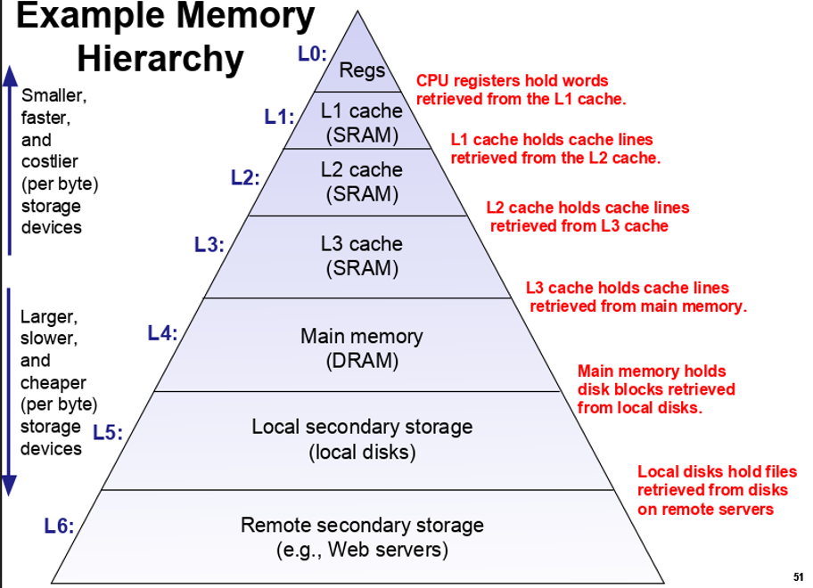

CPE = Cycles per element
## Code Motion:
- If you see computations done inside a loop that is constant, move out of the loop!
	- e.g. `for (int i = 0; i < len(str); i++)` move `len(str)` outside
	- Compiler doesn't know if function has side effect/is constant input, so it can't do optimization itself
## Strength Reduction
- Some operations are expensive
	- e.g. do repeated addition to counter instead of multiplication
## Share common sub expressions
- Lower number of instructions per iteraiton
## Avoid going to memory
- Avoid deferencing (e.g. arrays)
## Loop unrolling
- incrementing by 2 or more instead of one for repeated operation
## Reassociation:
- do unrelated operations first before combining with acculumator or similar
## Using accumulators
- Split up work to opreate on multiple idependent accumulators
## Memory Hirearchy

## Locality
- Temporal locality: Stuff accessed in memory is likely to be accessed again (accumulator, loop condition)
- Spatial locality: We use items that are near previous items, think about arrays and even the instructions themselves
