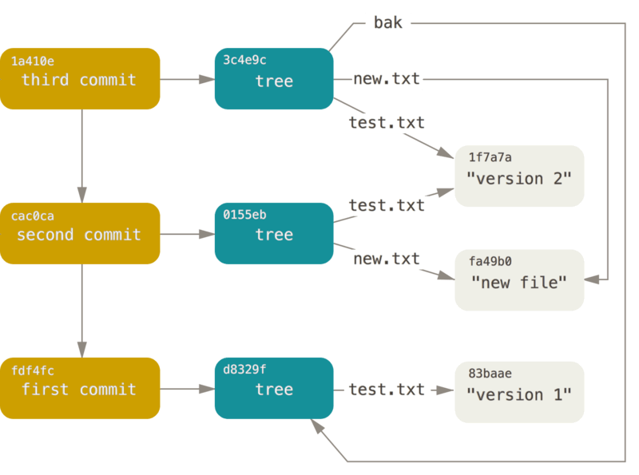

# More git internals

- Everything is an object, zlib/gzip encoded
	- Maps contents to name AND contents to name, unlike inodes which is name to contents
	- Objects are named by contents
	- Atomic updates to collection of items: rename operations are atomic
- Objects are made read-only
## Objects
- `git hash-object`: read files and outputs hash, `-w` to write to repo, `--stdin`
	- Uses SHA-1, 40 hex characters, 160 bits
- `git cat-file HASH` print contents of file with hash HASH, `-p` pretty print, `-t` print object type
```
type size\00DATA
```
## Types of objects
- blob: sequence of bytes
- commit:
```
tree TREE-OBJ
parent PARENTS
author NAME <EMAIL> 1243040974 -0700
committer NAME <EMAIL> 1243040974 -0700
PGP_SIGNATURE
COMMIT_MESSAGE
```
- Author created commit, committer put into this repo
- tree:
```
PERMISSION TYPE HASH NAME
100644 blob 12345abcdef .gitignore
```
- permission: last 3 are linux perms, first 2 file type, middle one is suid/sgid/sticky bit
## Compression
- Generates output that is smaller than its input, but can be uncompressed back to the original contents
- Used as trade-off of CPU time to compress/decompress vs space on secondary storage and readtime
- Tradeoff: fast compression, not so good compression ratio (good for constant writes), or vice versa (good for constand reads but few writes)
- Also compression takes a lot of memory
### Huffman encoding
- Huffman compression/encoding
	- How to send a symbol string to a recipient
	- Give specific symbol strings a certain very short representation
	- Allow multiple various types via a compression table:
```
e 0
f 10
g 1110
h 11110
```
- Build table:
	- Make leaves be all of the symbols (like letters) and have the probabilities for each
	- Combine 2 lowest occurance leaves over and over until all combined.
	- Once done, label left as `0` and right as `1`. To get bit string representation, simply start at top and read 0/1 down to node
- Dynamic huffman encoding:
	- Start with tree assuming everything balanced
	- byte is sent, then internal tree is updated with frequency weights
	- decompressor uses this information to then update its internal state before receiving next byte
	- trees stay in sync between the compressor and decompressor
	- Less efficient space-wise if static table is better, but more flexible especially if input is generally the same
### Dictionary Encoding
- Look for common strings of symbols
	- Don't limit to individual characters, but look at strings
	- e.g. compress using long list of words
- Compared to huffman: huge dictionary (256 vs thousands), but better compression
- Dynamic dictionary:
	- Use a window over the input: use previous window of content as the dictionary itself, and a number reference is the index from previous input + number of chars to copy from "dictionary"
### Zlib:
- Take dictionary encoding, and then huffman encode