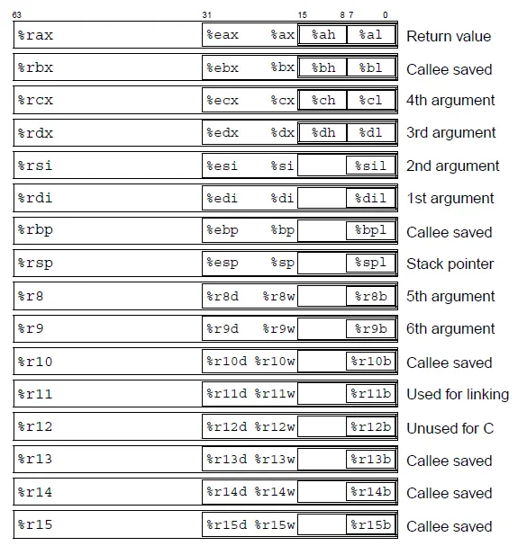

# Data lab stuff
How do programs actually work? 
hello.c (source, text) → preprocessor (cpp)
hello.i (modified source, text) → compiler (cc1)
hello.s (assembly, text) → assembler (as)
hello.o/printf.o (object programs/binaries) → linker (ld)
hello (executable) 
```c
int isEqual(int x, int y) {
return !(x ^ y);
}
int negate(int x) {
return ~x + 1;
}
```
```
x & y = ~(~x | ~y)
x | y = ~(~x & ~y)
```
UMax = 0, UMax = 2^w-1^
TMin = -2^w-1^, TMax = 2^w-1^ - 1

Basically, if MSB is set to 1, if unsigned add 2^31, if signed subtract 2^31 instead.
# Registers

Condition Codes
- CF (carry): set when unsigned overflow: overflowing out of range
- ZF (zero): set when result = 0
- SF (sign): set when result < 0 (signed)
- OF (overflow): set when signed overflow: overflowing into MSB, wrapping around sign
## Setting Registers
- `movq 0x539, %eax` Think `eax = 0x539`
- `movq %rax, %rbx` think `rbx = rax`
- Can move between partial registers of the **same size**
- Note: writing to 32 bit partial, will zero out the rest of the register
### Size Letters
- 'q' for qword (64bits), l' is for long (32bits), 'w' is for word (16bits), and 'b' is for byte (8bits).
	- gdb for whatever reason uses 'g' for 'giant word' instead of q
### Extending Data
- Extend signed data: use `movs[SS]` to do a sign-extending move between different sized, where SS are 2 letters for the sizes to move between
	- Preserves two's complement
### Basic Instructions

- exch: swap registers
## Special registers are special
- `%rip` = address of next instruction to execute
- `%rsp` = top of the stack
- `%rbp` = often used as bottom of stack frame, but not strictly required
## Memory Stack (temporary data storage)
- Stack has several uses
- Registers and immediates (hard-coded values) can be **push**ed onto the stack to save values:
```asm
movq $0xc001ca75, %rax
pushq %rax
pushq $0xb0bacafe # note: can only push 32-bit immediates, to push 64-bit must push from register
```
- Stack: c001ca75, b0bacafe, c001ca75
- Values can be **pop**ped back off of the stack to any register in reverse order:
```asm
popq %rbx # rbx set to 0xb0bacafe
popq %rcx # rcx set to 0xc001ca75
```
- Each entry is width of architectures
	- Note: pop technically doesn't remove bytes from stack, just moves stack pointer
### Addressing the stack
- CPU stores stack location in `%rsp`
	- Generally high memory location, grows towards smaller memory locations
	- push decreases rsp by 8, pop increases it by 8
- You can also move data between registers and memory with mov
- Load 64-bit value stored at memory address 0x12345:
```asm
movq $0x12345, %rax
movq (%rax), %rbx
```
- Store 64-bit value in rbx intro memorty at address 0x133337:
```python
movq 0x133337, %rax
movq %rbx, (%rax)
```
- Equivalent to `pushq %rcx`:
```python
subq $8, %rsp
movq %rcx, (%rsp)
```
- Each addressed memory location contains one byte 
	- 8-byte (64-bit) address write at 0x133337 will write to addresses 0x133337 through 0x13333f
## Memory edianess
- Data on most modern systems is stored *backwards*, in *little endian*
```python
movl %eax, 0xc001ca75 # %eax: c0 | 01 | ca | 75 
movq %rcx, 0x10000
movl (%rcx), %eax # (0x10000) 75 | (0x10001) ca | (0x10002) 01 | (0x10003) c0
movb %bh, (%rcx) # reads 0x75
```
- Bytes are ONLY shuffled for multi-byte stores and loads of registers to memory
	- Individual bytes NEVER have their bits shuffled
	- Writes to the stack w/ push/pops behave just like any other write to memory
	- Bytes are ONLY shuffled WITHIN a single primitive data type - the elements of an array are NOT shuffled
## Address Calculation
- You can do some limited calculation for memory addresses
- Get calculated address with Load Effective Address (lea)
	- Does calculation for which memory address to retrieve but then stores the memory address rather than deferencing it
- `(Rb, Ri) = MemoryLocation[Rb + Ri]`
- `D(Rb, Ri) = MemoryLocation[Rb + Ri + D]`
- `(Rb, Ri, S) = MemoryLocation(Rb + S * Ri]`
- `D(Rb, Ri, S) = MemoryLocation[Rb + S * Ri + D]`
### Writing Immediate values
- write 32-bit 0x1337 to address 0x133337:
```asm
movq %rax, 0x133337
movl $0x1337, (%rax)
```
## Struct Alignment
The following three rules must be adhered to in order for something to be properly aligned
- Every field must be aligned to the size of it’s data type. This means it must start on an address that is
a multiple of it size
- The overall structure must be aligned to the size of it’s largest data type
	- The overall structure must have a size that is a multiple of its largest data type

# Control Flow
- Change flow: `jmp LABEL`
```asm
	mov cx, 1337
	jmp STAY_LEET
	mov cx, 0
STAY_LEET:
	push rcx
```
- Note: jump is signed, meaning you can jump backwards
- Think jmp as adding value to rip
## Conditional Jumps


- Note that jz = je and jne = jnz
- Uses result of last operation
- `rflags` register: has flags, such as carry flag, zero flag, overflow flag, signed flag, etc
	- Update using `cmp` or `test`
		- `cmp` is same as `sub	` but discarding result
		- `test` same as `and` but discards result
- Common patters:
```asm
cmpq %rax, %rbx;
ja LABEL # unsigned rbx > rax
cmp %rax, %rbx
jle LABEL # signed rbx <= rax
testq %rax, %rax # Same as cmpq $0, %rax
jnz LABEL # rax != 0
cmpq %rax, %rbx
je LABEL # %rbx == %rax
```
## Looping!
- We can implement a loop!
```asm
movq $0, %rax
LOOP_HEADER:
inc %rax
cmpq $10, %rax
jb LOOP_HEADER
```
## Function calls!
- Assembly call split into functions with `call` and ret
	- call pushes `rip` and jumps away (enter function)
	- ret pops `rip` and jumps to the value it got from the stack (return)
## Calling Conventions
- Agreements on argument passing
	- x86-64: rdi, rsi, rdx, rcx, r8, r9, push in reverse order, return value in rax
		- function promises to return `rbx, rbp, r12, r13, r14, 15` back to original state if modified, and technically rsp
		- "callee-saved" (vs the others are "caller-saved")
## "String" arguments
- String is a bunch of contiguous bytes in memory (aka char array), followed by a 0 or null byte
- As strings are made of chars, endianess does NOT affect how they are viewed in memory